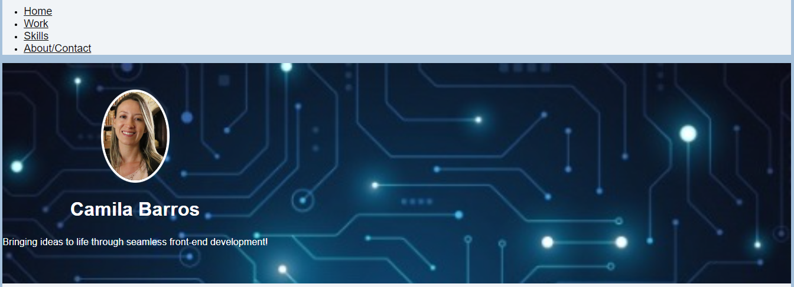
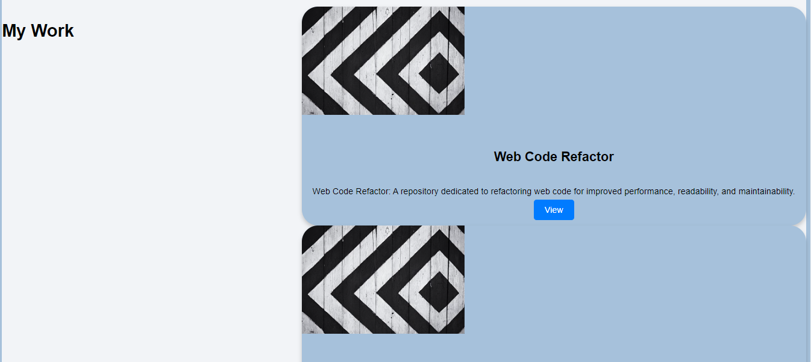
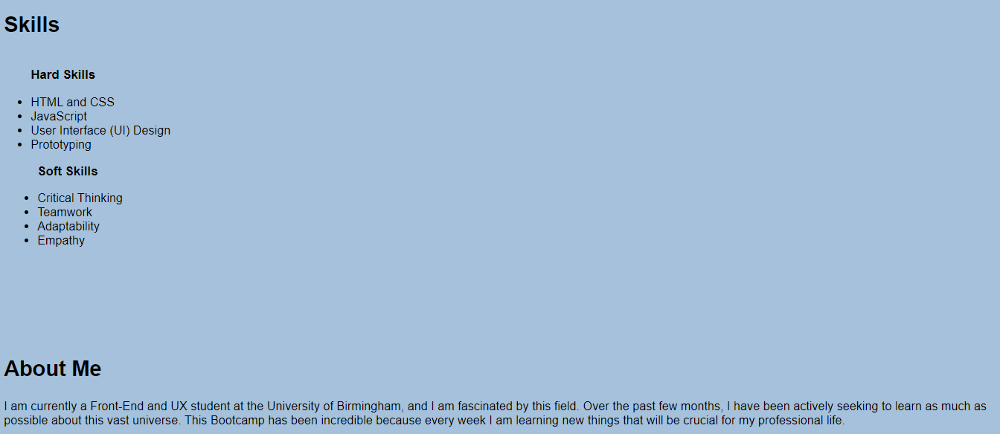
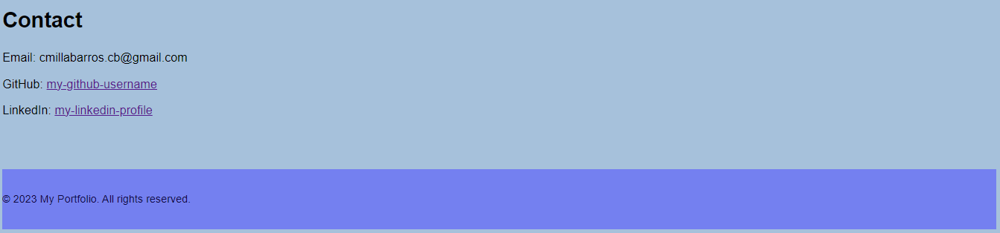

# first_portfolio

## Table of Contents

- [Description](#description)
- [Screenshots](#Screenshots)
- [Overview](#Overview)
- [Technologies](#Technologies)
- [Installation](#Installation)
- [Resources](#Resources)
- [License](#license)
- [GitHub](#GitHub)
- [Deployed](#Deployed)

## Description

This is my portfolio project, developed using only HTML and CSS. The purpose of this project is to showcase my work, skills, and information about myself in an organized and stylish manner.

## Screenshots

Before delving into the details of my projects, you can have a visual preview of my portfolio through the screenshots below:

## Overview

Welcome to my portfolio!
My name is Camila, and I am a frontend student and UX/UI designer. I have a passion for creating digital experiences.

**Objective:** My goal is to leverage my frontend and interface design skills to develop visually appealing, functional, and high-quality web solutions. I am eager to contribute to challenging and innovative projects, creating intuitive and captivating interfaces that enhance the user experience.

**Target Audience:** My portfolio is aimed at potential recruiters and fellow professionals who want to explore my work and skills in frontend and UX/UI design. I am also open to collaboration opportunities and freelance projects.

**Key Features:**

- Responsive and accessible interface development using HTML and CSS.
- Creation of attractive and intuitive interface designs with a focus on usability and user experience.
- Prototyping and visualizing design concepts using tools like Figma.
- Effective collaboration in multidisciplinary teams, leveraging my technical and design skills.

## Technologies

- HTML
- CSS

## Installation

Clone the repository using the following link: `git@github.com:Camilasbarros/first_portfolio.git`
Open in your browser

## Resources:

The main resources and functionality of my portfolio include:

- Visually appealing presentation: My portfolio utilizes elaborate design, combining colors, layouts, and visual elements to create a pleasant experience for visitors.

- Projects section: The portfolio features a dedicated section showcasing my projects, displaying images and descriptions for each of them. Visitors can click on "View" buttons to get more information or access my projects.

- Responsiveness: My portfolio is responsive, adapting and optimizing its layout for different screen sizes, allowing visitors to view my work appropriately on mobile devices, tablets, and desktops.

- Intuitive navigation: The top navigation bar in the portfolio enables visitors to easily access different sections such as Home, Projects, Skills, and About/Contact.

- About Me section: In addition to the projects section, my portfolio includes a section providing information about myself, with a brief description. This section may also include contact details such as email, GitHub, and LinkedIn.

- Highlighted skills: My portfolio highlights both hard and soft skills, allowing visitors to have a quick and clear overview of my competencies.

Examples of using my portfolio include:

Recruiters and potential employers can visit my portfolio to assess my technical and creative skills, as well as to explore my previous projects.

Colleagues and professionals in the industry can also visit my portfolio to learn about my skills and recent projects, which may lead to networking and collaboration opportunities.

Author
[Your Name]

## License

This project is licensed under the MIT License. See the [LICENSE](./LICENSE) file for details.

## GitHub

[Link to GitHub repository](git@github.com:Camilasbarros/first_portfolio.git)

## Deployed

[Link to deployed application](https://camilasbarros.github.io/first_portfolio/)
